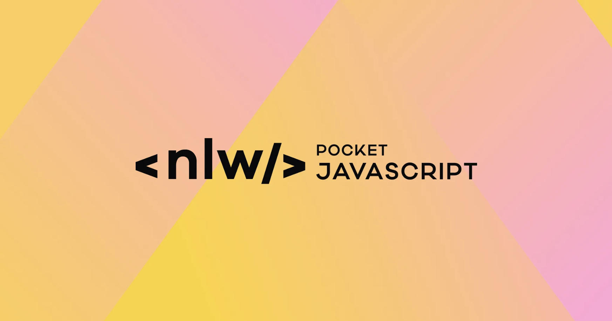

<p align="center">
  </a>
</p>

<p align="center">
		<em>Developed with the software and tools below.</em>
</p>

<p align="center">
    
    
    
    
    
    <br>
    
    
    
    
    
    
</p>

## 📝 Overview

This API was developed to provide a robust and flexible solution, allowing third-party applications to integrate functionality for defining, monitoring and managing user goals. The main goal is to facilitate progress tracking and promote engagement in achieving personal and professional goals.

The application was developed using several technologies from the JavaScript ecosystem, as well as complementary tools to facilitate the creation and editing of database queries. A specific database was implemented for testing, ensuring a controlled environment for validating the functionalities. In addition, we guarantee the quality of the code through automated tests that validate the correct functioning of the application, ensuring that all functionalities meet the specified requirements.

[PT-BR]

Esta API foi desenvolvida para fornecer uma solução robusta e flexível, permitindo que aplicações de terceiros integrem funcionalidades de definição, monitoramento e gerenciamento de metas do usuário. O objetivo principal é facilitar o acompanhamento de progresso e promover o engajamento na realização de objetivos pessoais e profissionais.

A aplicação foi desenvolvida utilizando diversas tecnologias do ecossistema JavaScript, além de ferramentas complementares para facilitar a criação e edição de consultas (queries) em banco de dados. Um banco de dados específico foi implementado para testes, assegurando um ambiente controlado para validação das funcionalidades. Além disso, garantimos a qualidade do código por meio de testes automatizados que validam o funcionamento correto da aplicação, assegurando que todas as funcionalidades atendam aos requisitos especificados.

---

## 📦️ Functionality

- [x] Login with GitHub
- [x] Authentication
- [x] Goal registration
- [x] List of goals
- [x] Marking of goal accomplished
 
## 🏷️ Getting Started

To run this application, it is essential that you have Node.js and Docker installed on your device.

Make sure both tools are installed and working properly before proceeding to run your application. Proper installation of Node.js and Docker is crucial to ensure optimal performance and avoid compatibility issues during runtime.

**System Requirements**

* **Node.Js**: `version 20.18.0`
* **Docker**: `version 27.3.1`
* **GitHub Profile**
* **Register application on gitHub**

Create an .env file based on the .env.example file to set the environment variables required for the application to run. Be sure to customize the settings as needed for your local environment.

---

### 🗃️ Installation

<h4>From <code>source</code></h4>

> 1. Clone the repository:
>
> ```console
> $ git clone https://github.com/diego64/in.orbit/tree/main/api
> ```
>
> 2. Change to the project directory:
> ```console
> $ cd in.orbit/tree/main/api
> ```
>
> 3. Install the dependencies:
> ```console
> $ npm install
> ```
> 4. Install the database:
> ```console
> $ docker compose up -d
> $ npx drizzle-kit generate
> $ npx drizzle-kit migrate
> ```
> 5. Start the application:
> ```console
> $ npm run dev
> ```
---

### 🧪 Tests

> Run the test suite using the command below:
> ```console
> $ npm run test
> ```
