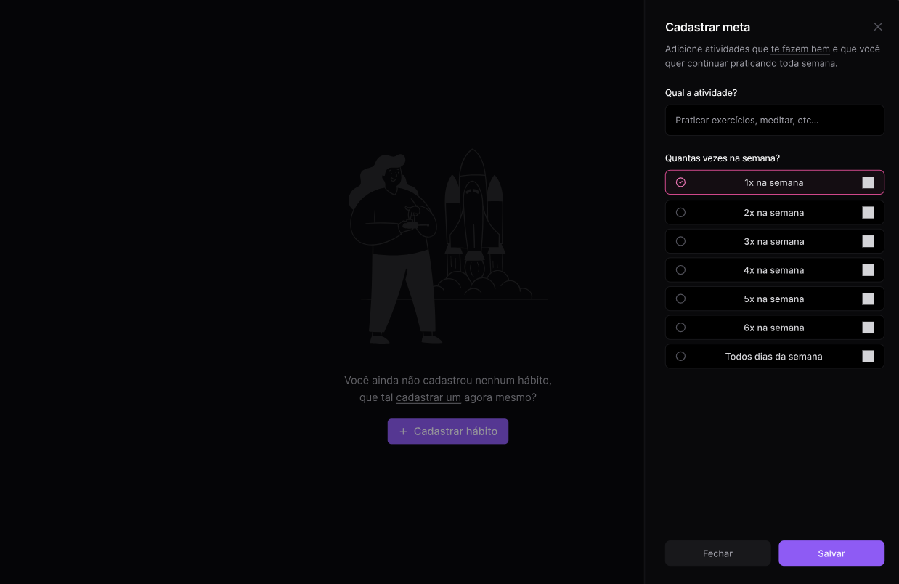

<p align="center">
  </a>
</p>

<p align="center">
		<em>Developed with the software and tools below.</em>
</p>

<p align="center">
    
    
    
    
        <br>
    
    
    
</p>

## 📝 Overview

This web application allows users to register via GitHub to set and track weekly goals. With a focus on encouraging the achievement of personal and professional goals, the application incorporates gamification elements, offering a scoring system that rewards each completed goal with experience points (XP). As users accumulate XP, they can level up, providing an interactive and motivational experience that encourages them to continue evolving towards their weekly goals.

[PT-BR]

Esta aplicação web permite que o usuário realize seu cadastro via GitHub para definir e acompanhar metas semanais. Com o foco em incentivar o cumprimento de objetivos pessoais e profissionais, a aplicação incorpora elementos de gamificação, oferecendo um sistema de pontuação que recompensa cada meta concluída com pontos de experiência (XP). À medida que acumula XP, o usuário pode subir de nível, promovendo uma experiência interativa e motivacional que o estimula a continuar evoluindo em suas metas semanais.

---

## 📦️ Functionality

- [x] Login with GitHub
- [x] Authentication
- [x] Goal registration
- [x] List of goals
- [x] Marking of goal accomplished
- [x] User gamification
- [x] Access goals from past weeks
 
---

## 🏷️ Getting Started

To run this application, it is essential that you have Node.js and Docker installed on your device.

Make sure both tools are installed and working properly before proceeding to run your application. Proper installation of Node.js and Docker is crucial to ensure optimal performance and avoid compatibility issues during runtime.

**System Requirements**

* **Node.Js**: `version 20.18.0`
* **GitHub Profile**
* **Register application on gitHub**

Create an .env file based on the .env.example file to set the environment variables required for the application to run. Be sure to customize the settings as needed for your local environment.

---

### 🗃️ Installation

<h4>From <code>source</code></h4>

> 1. Clone the repository:
>
> ```console
> $ git clone https://github.com/diego64/in.orbit/tree/main/web
> ```
>
> 2. Change to the project directory:
> ```console
> $ cd in.orbit/tree/main/web
> ```
>
> 3. Install the dependencies:
> ```console
> $ npm install
> ```
> 4. Start the application:
> ```console
> $ npm run dev
> ```
---